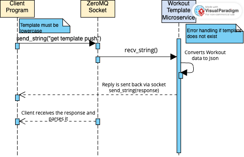

# Workout Template Generator Microservice

This microservice provides predefined workout templates for Push, Leg, and Full body exercises to help users with their workout routines. 
This microservices received a command over a ZeroMQ REQ socket and respond with the corresponding template in a JSON format

## Communication Contract
This microservice listens on `tcp://localhost:5555` using a **ZeroMQ REP socket**. It responds with a predefined workout template when it receives a valid request.
- Socket Type: REP(Reply)
- Port: 5555

## How to Programmatically REQUEST Data
To request a workout template, connect to the microservice using a ZeroMQ REQ socket and send a string in the following format:

```python
# Example Python:
socket.send_string("get template push")
```
Replace "push" with any of the following supported template names:
- `push`
- `leg`
- `full body`

## How to Programmatically RECEIVE Data
```python
#Example Python
template = socket.recv_string()
workout_data = json.loads(template)
```
The response will be a JSON-formatted list of exercises, each containing:
- exercise (name of the exercise)
- sets (number of sets)
- reps (number of reps or time)

```python
[
  {"exercise": "Bench Press", "sets": 4, "reps": 8},
  {"exercise": "Overhead Press", "sets": 3, "reps": 10},
  {"exercise": "Triceps Dips", "sets": 3, "reps": 12}]
```
## UML Sequence Diagram
The diagram below illustrates how the client interacts with the template generator microservice using ZeroMQ
- The client program sends a request message (ex: "get template push") to the microservice using a REQ socket.
- Workout template Microservice receives the request using REP socket
- Validates matching template, formats it as a JSON file, and sends it back
- The Client program receives the response and uses it in the main app.



